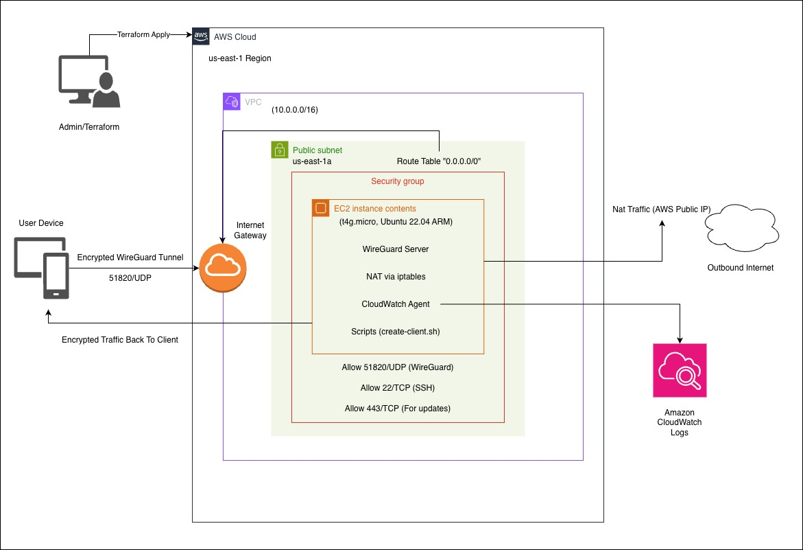

# Secure WireGuard VPN on AWS with Terraform

A production-ready, secure, and cost-effective WireGuard VPN infrastructure fully automated with Terraform on AWS.

## 🎯 Project Overview

This project implements a modern VPN solution using WireGuard deployed on AWS infrastructure. It showcases expertise in:

- **AWS Services**: VPC, EC2, Security Groups, Internet Gateway, Route Tables
- **Infrastructure as Code**: Terraform for complete automation
- **Cloud Security**: Minimal attack surface, encrypted tunnels, IMDSv2, firewall rules
- **Linux Administration**: Ubuntu Server, iptables, systemd
- **Networking**: VPN protocols, NAT, IP forwarding, routing
- **DevOps**: Automated provisioning and client management scripts

## 🏗️ Architecture



**Key Components:**
- VPC with public subnet
- EC2 instance running WireGuard (ARM-based for cost efficiency)
- Security Group allowing only UDP 51820 (SSH optional, IP-restricted)
- Automated client provisioning with QR code generation
- NAT with iptables for internet routing

## 🛡️ Security Features

- **Minimal Attack Surface**: Only WireGuard port exposed
- **SSH Disabled by Default**: Optional IP-restricted access
- **IMDSv2 Required**: Protection against SSRF attacks
- **Modern Cryptography**: WireGuard's state-of-the-art encryption (ChaCha20, Curve25519)
- **Secure Key Storage**: Private keys with 600 permissions
- **Dynamic Interface Detection**: No hardcoded network interfaces
- **NAT with iptables**: Secure traffic forwarding

## 🚀 Technology Stack

| Component | Technology |
|-----------|-----------|
| Cloud Provider | AWS |
| IaC | Terraform 1.5+ |
| VPN Protocol | WireGuard |
| OS | Ubuntu 22.04 LTS (ARM64) |
| Instance Type | t4g.micro (ARM-based, Free Tier eligible) |
| Automation | Bash scripts |

## 📋 Prerequisites

- AWS account with appropriate permissions
- Terraform >= 1.5 installed
- AWS CLI configured
- SSH key pair for EC2 access

## 🚀 Quick Start

### 1. Create SSH Key Pair

```bash
aws ec2 create-key-pair --key-name vpn-key --query 'KeyMaterial' --output text > vpn-key.pem
chmod 400 vpn-key.pem
```

### 2. Configure Variables

```bash
cd terraform
cp terraform.tfvars.example terraform.tfvars
# Edit terraform.tfvars with your settings
```

### 3. Deploy Infrastructure

```bash
terraform init
terraform apply
```

### 4. Create Client (after ~2 min setup)

```bash
# SSH into server
ssh -i ../vpn-key.pem ubuntu@$(terraform output -raw vpn_public_ip)

# Create client
sudo bash /opt/wireguard/scripts/create-client.sh myclient
```

### 5. Connect

- **Mobile**: Scan the QR code displayed
- **Desktop**: Download config and import into WireGuard client

```bash
# Download config locally
scp -i ../vpn-key.pem ubuntu@<IP>:/opt/wireguard/clients/myclient.conf .
```

## 🔧 Configuration

### Variables

Edit `terraform/terraform.tfvars`:

```hcl
region         = "us-east-1"
az             = "us-east-1a"
ami_id         = ""  # Auto-detects latest Ubuntu 22.04 ARM
key_name       = "vpn-key"
ssh_allowed_ip = "YOUR_IP/32"  # Leave empty to disable SSH
```

## 📊 Cost Estimation

| Resource | Monthly Cost (USD) |
|----------|-------------------|
| t4g.micro instance | $0 - $6.13 (Free Tier eligible) |
| EBS Storage (8 GB) | ~$0.80 |
| Data Transfer (first 100 GB) | FREE |

**Total**: ~$1/month with Free Tier, ~$7-10/month without

## 📝 Client Management

```bash
# Create client
sudo bash /opt/wireguard/scripts/create-client.sh <name>

# List clients
sudo bash /opt/wireguard/scripts/list-clients.sh

# Remove client
sudo bash /opt/wireguard/scripts/remove-client.sh <name>
```

## 📁 Project Structure

```
vpnFFE/
├── terraform/
│   ├── main.tf                  # Infrastructure + embedded scripts
│   ├── variables.tf             # Input variables with validation
│   ├── outputs.tf               # Output values
│   └── terraform.tfvars.example # Example configuration
├── scripts/                     # Reference scripts (deployed via user_data)
│   ├── create-client.sh
│   ├── list-clients.sh
│   └── remove-client.sh
├── architecture/
│   └── diagram.jpg
└── README.md
```

## 🧪 Verify Connection

```bash
# Before VPN
curl ifconfig.me  # Shows your real IP

# After connecting to VPN
curl ifconfig.me  # Shows AWS server IP
```

## 🚧 Future Enhancements

- Multi-region deployment
- High availability with Auto Scaling
- CloudWatch monitoring dashboard
- CI/CD with GitHub Actions
- Route53 DNS integration

## 📄 License

MIT License

## 👤 Author

Francisco Flores Enriquez  
Computer Systems Engineering Student
